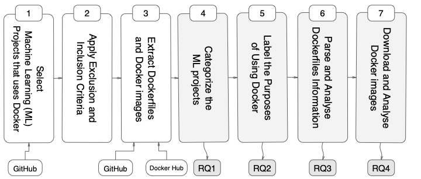
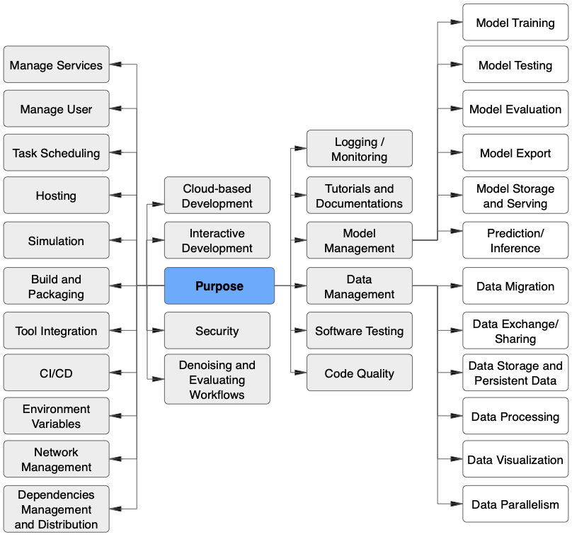

### Studying the Practices of Deploying Machine Learning Projects on Docker

#### Abstract

Docker is a containerization service that allows for convenient deployment of websites, databases, applications' APIs, and machine learning (ML) models with a few lines of code. Studies have recently explored the use of Docker for deploying general software projects with no specific focus on how Docker is being used to deploy ML-based projects. In this study, we conducted an exploratory study to understand how Docker is being used to deploy ML-based projects. As the initial step, we examined the categories of ML-based project that use Docker. We then examined why and how these projects use Docker, and the characteristics of the resulting Docker images. Our results indicate that six categories of ML-based projects use Docker for deployment, including ML Applications, MLOps/ AIOps, Tookits, DL Frameworks, Models, and Documentation. We derived the taxonomy of 21 major categories representing the purposes of using Docker, including those specific to models such as model management tasks (e.g., testing, training). We then showed that ML engineers use Docker images mostly to help with the platform portability, such as transferring the software across the operating systems, runtimes such as GPU, and language constraints. However, we also found that more resources may be required to run the Docker images for building ML-based software projects due to the large number of files contained in the image layers with deeply nested directories. We hope to shed light on the emerging practices of deploying ML software projects using containers and highlight aspects that should be improved.

#### Table of Contents  

 [Study Design](#Reseach-Questions)  
> We describe the methodology of this step as follows: An overview of these step is presented in Figure 1.

> Figure 1: An overview of the methodology we followed in this study

- Our methodology include generating the set of topics to identify ML repositories hosted on GitHub
- Use the keywords to extract the ML based repositories then filtered out the ML repositories that do not employ docker in their deployment process.
- We categoried the curated list of ML projects that used the docker in to six categoies representing the types of ML/ domain.
- Next step was to dig deeper and understand the purpose for using docker, the result of this step is presented in Figure 2
- We then extracted the dockerfiles of the curated ML projects and analysed the information such as the instructions, the commands purposes, and the types of base images being used.

- The final part of the methodology was to understant the characteristics of the actual images for building and deploying ML software projects.

[Purpose for Using Docker](#Purpose)  
> There is a broader range of 21 major purposes of using Docker in the deployment process of ML-based software projects (shown in Figure 2), such as model management, software testing, setting interactive development, data management, automate and running software or model tests,
checking the code quality, distribution of tutorials/ documentation, Continuous integration and continuous delivery/ deployment (CI/CD), and build/ packaging among others. Other ML engineers can learn from our observations and implement Docker in their deployment process for these similar purposes.

> Figure 2: The mindmap represing the main purposes for using docker in ML based software projects

 [Source](#Source)  
> With this repository is included a complete working source code to reproduce the whole results reported in this Study i.e., analyse-docker.
A simple configuration may be required before running the code.

In the following, you will find a brief descriptions of what is contained in the source code and how to get started.

 [Datasets](#Datasets)  
> All dataset used for this study can be found in the folder Dataset. The sub-directories are self-explainatory.

There are four folders named RQ1, RQ2, RQ3, RQ4

Each folders contains the dataset answering the respective research questions. please refer to our paper.

We also include the raw dataset in a folder raw, that contains the raw data of the Dockerfiles and dockerimages. Both as a processed csv files and unprocessed Dockefiles or docker dockerimages.

Sample examples of the Dockerfiles or docker images can be found in the folder named samples.
